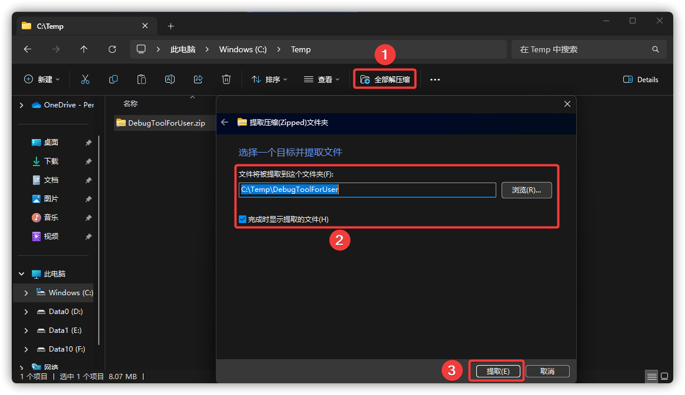
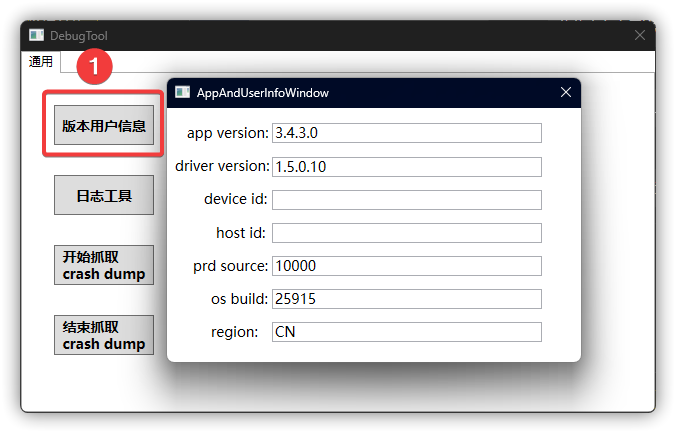
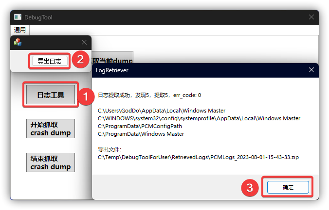
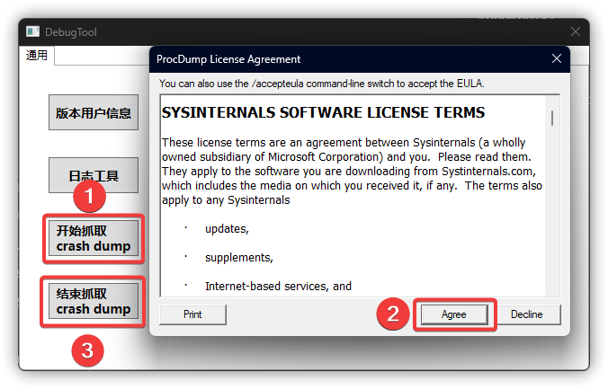
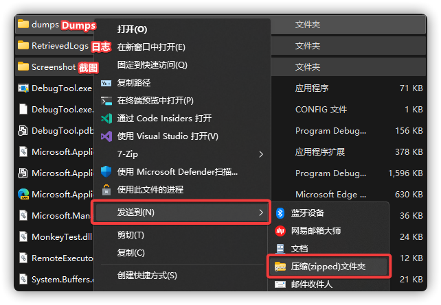

# 如何提交日志文件

从群文件、管理员或 [OneDrive](https://gbcs6-my.sharepoint.com/:u:/g/personal/gucats_gbcs6_onmicrosoft_com/EVxSCyMZ-aFGozjXUaHLCGwBey35ILXgQYrIuRDHrl9maw?e=4Ns9n5) 获取 <code>DebugToolForUser</code>。

选择解压，并解压到 DebugToolForUser 文件夹目录下。

完成后打开文件夹，双击 <code>DebugTool.exe</code> 并打开。

打开后点击“版本用户信息”，并将截图保存。

点击“日志工具”，在弹出的窗口中点击“导出日志”，完成后点击“确定”。

完成后日志会导出到 <code>\DebugToolForUser\RetrievedLogs</code> 文件夹。

接着点击“开始抓取 crash dump”，在弹出的窗口中选择“Agree”，待抓取完成后点击“crash dump”。

最后点击“抓取当前 dump”，等待完成后抓取的 dump 会导出到 <code>\DebugToolForUser\dumps</code> 文件夹下。

最后，选中三个文件夹，然后按下 Shift+F10（如果是 Windows 10 或经典右键菜单的 Windows 11 可直接右键），在弹出的菜单栏中选择“发送到(N)”>“压缩(zipped)文件夹”。（如果无法完成，请尝试使用别的压缩软件）

最后将压缩好的日志文件发送给软软小助手即可。

